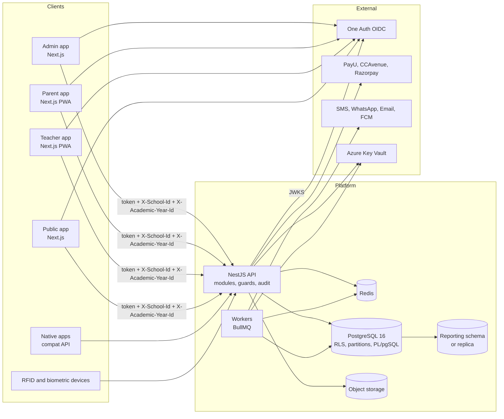
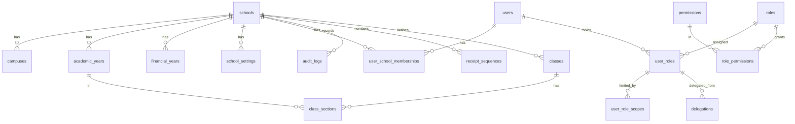

# Foundation design (Sprint 0 to Sprint 2)

Scope: everything every other module depends on. Tenancy, years, identity, RBAC, audit, the database procedure layer, API conventions, the BFF, environments and CI. The reference module in `01-reference-module.md` shows the pattern applied once.

---

## 1. Principles

1. The database enforces isolation (RLS) and atomicity (procedures); the API enforces authorisation and validation; the UI only presents.
2. Deny by default. No handler without a permission. No query without a tenant context.
3. Stable identity: one row per person, per class, per fee head; years are dimensions.
4. Everything auditable, privileged actions doubly so.
5. Configuration over code. No per-school branches.
6. Tokens over pixels. The UI is built only from the Mobilise design system.

---

## 2. Logical architecture



---

## 3. Request lifecycle

```mermaid
sequenceDiagram
  participant B as Browser
  participant N as Next.js BFF
  participant API as NestJS API
  participant PG as PostgreSQL
  B->>N: GET /academics/classes (session cookie)
  N->>N: read session (access token, school_id, year_id)
  N->>API: GET /api/v1/academics/classes<br/>Authorization: Bearer, X-School-Id, X-Academic-Year-Id, X-Request-Id
  API->>API: JwtGuard verifies token (JWKS)
  API->>API: TenantInterceptor: membership(user, school) ok, year belongs to school
  API->>API: PermissionGuard: academics.class.view in effective permissions
  API->>PG: BEGIN; SET LOCAL app.school_id, app.user_id, app.allowed_school_ids
  API->>PG: SELECT ... FROM classes (RLS filters by school)
  PG-->>API: rows
  API->>PG: COMMIT
  API-->>N: 200 JSON (+ audit if mutating)
  N-->>B: rendered page
```

Rules encoded here: authentication before tenancy, tenancy before authorisation, authorisation before any query, and the tenant context set with `SET LOCAL` so it dies with the transaction and cannot leak through the connection pool.

---

## 4. Data model (foundation)



### 4.1 Table catalogue

Conventions on every table: `id BIGINT GENERATED ALWAYS AS IDENTITY PRIMARY KEY`, `created_at TIMESTAMPTZ NOT NULL DEFAULT now()`, `created_by BIGINT`, `updated_at TIMESTAMPTZ NOT NULL DEFAULT now()`, `updated_by BIGINT`, `deleted_at TIMESTAMPTZ NULL` (soft delete), `legacy_ref TEXT NULL` (source table and key for ETL traceability). Tenant tables add `school_id BIGINT NOT NULL REFERENCES schools(id)` as the second column and in every index.

| Table                     | Scope                                  | Key columns                                                                                                                                                                                                                                                                  | Notes                                                                                   |
| ------------------------- | -------------------------------------- | ---------------------------------------------------------------------------------------------------------------------------------------------------------------------------------------------------------------------------------------------------------------------------- | --------------------------------------------------------------------------------------- |
| `schools`                 | global, membership-filtered            | `code` unique, `name`, `affiliation_no`, `board` (CBSE, ICSE, STATE, IB), `group_id`, `timezone`, `status`                                                                                                                                                                   | One row per legal school                                                                |
| `school_groups`           | global                                 | `code`, `name`                                                                                                                                                                                                                                                               | Trust or group                                                                          |
| `campuses`                | tenant                                 | `school_id`, `code`, `name`, `address`                                                                                                                                                                                                                                       | Physical sites                                                                          |
| `academic_years`          | tenant                                 | `school_id`, `code` (2026-27), `start_date`, `end_date`, `status` (planned, active, locked, closed), `locks JSONB` (attendance, exams, fees)                                                                                                                                 | Exactly one `active` per school (partial unique index)                                  |
| `financial_years`         | tenant                                 | same shape as academic years                                                                                                                                                                                                                                                 | Fee accounting periods                                                                  |
| `school_settings`         | tenant                                 | `school_id`, `key`, `value JSONB`, `valid_from`, `valid_to`                                                                                                                                                                                                                  | Typed on read by the settings service; replaces `AppConf.php` and `tbl_module_settings` |
| `users`                   | global, membership-filtered            | `oneauth_sub` unique, `email`, `mobile`, `display_name`, `preferred_locale`, `status`, `last_login_at`                                                                                                                                                                       | Credentials live in One Auth only                                                       |
| `user_school_memberships` | tenant                                 | `user_id`, `school_id`, `person_type` (employee, guardian, student, external), `person_ref_id`, `status`                                                                                                                                                                     | Determines `allowed_school_ids`                                                         |
| `permissions`             | global                                 | `code` PK (`module.resource.action`), `module`, `description`, `requires_mfa`, `is_public_safe`                                                                                                                                                                              | Synchronised from code at API start                                                     |
| `roles`                   | tenant or template                     | `school_id NULL for templates`, `code`, `name`, `kind` (global, module), `is_system`, `description`                                                                                                                                                                          | School roles may extend templates                                                       |
| `role_permissions`        | follows role                           | `role_id`, `permission_code`                                                                                                                                                                                                                                                 |                                                                                         |
| `user_roles`              | tenant                                 | `user_id`, `role_id`, `school_id`, `campus_id NULL`, `valid_from`, `valid_to NULL`, `granted_by`, `reason`                                                                                                                                                                   | Unique on (user, role, school, campus, valid_from)                                      |
| `user_role_scopes`        | tenant                                 | `user_role_id`, `scope_type` (class_section, subject, department, route, campus), `scope_id`                                                                                                                                                                                 |                                                                                         |
| `sod_rules`               | tenant or template                     | `school_id NULL`, `permission_a`, `permission_b`, `description`                                                                                                                                                                                                              | Symmetric pairs                                                                         |
| `delegations`             | tenant                                 | `from_user_id`, `to_user_id`, `role_id`, `school_id`, `starts_at`, `ends_at`, `reason`, `created_by`, `revoked_at`                                                                                                                                                           |                                                                                         |
| `audit_logs`              | tenant, partitioned monthly            | `occurred_at`, `school_id`, `actor_type`, `actor_user_id`, `impersonated_by`, `action`, `entity_type`, `entity_id TEXT`, `before JSONB`, `after JSONB`, `diff JSONB`, `permission_code`, `request_id UUID`, `ip INET`, `user_agent`, `source` (api, trigger, job, migration) | Append-only                                                                             |
| `login_events`            | global, membership-filtered            | `user_id`, `school_id NULL`, `occurred_at`, `method` (oidc, dev, impersonation, compat), `ip`, `user_agent`, `outcome`                                                                                                                                                       | Replaces `LoginTracking`                                                                |
| `receipt_sequences`       | tenant                                 | `school_id`, `ledger_type` (school, hostel, misc, admission), `financial_year_id`, `prefix`, `next_no`, `width`                                                                                                                                                              | Row-locked by `app.next_receipt_no`                                                     |
| `files`                   | tenant                                 | `school_id`, `bucket`, `object_key`, `content_type`, `size_bytes`, `sha256`, `owner_entity_type`, `owner_entity_id`, `classification` (public, internal, personal, sensitive), `scanned_at`, `scan_result`                                                                   | Object storage index                                                                    |
| `jobs_outbox`             | tenant                                 | `school_id`, `queue`, `payload JSONB`, `status`, `available_at`, `attempts`                                                                                                                                                                                                  | Transactional outbox for reliable job publishing                                        |
| `classes`                 | tenant (reference module)              | `school_id`, `code`, `name`, `display_order`, `status`                                                                                                                                                                                                                       | Master class such as VI                                                                 |
| `class_sections`          | tenant, year-scoped (reference module) | `school_id`, `academic_year_id`, `class_id`, `name` (A), `capacity`, `campus_id NULL`                                                                                                                                                                                        | Section within a year                                                                   |

### 4.2 Indexing rules

- Every tenant table: `(school_id, id)` and `(school_id, <natural key>)` unique where a natural key exists.
- Year-scoped tables: `(school_id, academic_year_id, <lookup columns>)`.
- Partitioned tables: partition key first, then `school_id`.
- Partial index for soft delete: `WHERE deleted_at IS NULL` on hot lookups.

---

## 5. Tenancy and row-level security

### 5.1 Database roles

| Role              | Rights                                                                                                                                                                             | Used by                |
| ----------------- | ---------------------------------------------------------------------------------------------------------------------------------------------------------------------------------- | ---------------------- |
| `edupro_migrator` | owner of all objects; runs migrations; `NOBYPASSRLS`                                                                                                                               | CI migration step, DBA |
| `edupro_app`      | `CONNECT`, `USAGE` on schemas, `SELECT INSERT UPDATE DELETE` on tenant tables except audit (INSERT, SELECT only), `EXECUTE` on `app.*`; `NOBYPASSRLS`, `NOSUPERUSER`, `NOCREATEDB` | API and workers        |
| `edupro_readonly` | `SELECT` on reporting schema                                                                                                                                                       | BI, group dashboards   |

### 5.2 Context functions (`app` schema)

```sql
app.current_school_id()      -> bigint   -- from current_setting('app.school_id', true)
app.current_user_id()        -> bigint
app.allowed_school_ids()     -> bigint[] -- from current_setting('app.allowed_school_ids', true), '{1,2}'
app.current_request_id()     -> uuid
app.is_context_set()         -> boolean  -- guards accidental unscoped writes
```

### 5.3 Policy patterns

| Pattern                    | Applies to                         | Policy                                                                                                                                                             |
| -------------------------- | ---------------------------------- | ------------------------------------------------------------------------------------------------------------------------------------------------------------------ |
| Tenant                     | every tenant table                 | `USING (school_id = app.current_school_id()) WITH CHECK (school_id = app.current_school_id())`                                                                     |
| Membership-filtered global | `schools`, `users`, `login_events` | `USING (id = ANY(app.allowed_school_ids()))` for schools; users visible when they share a membership with an allowed school                                        |
| Template plus tenant       | `roles`, `sod_rules`               | `USING (school_id IS NULL OR school_id = app.current_school_id())`; `WITH CHECK (school_id = app.current_school_id())` so templates are read-only for the app role |
| Append-only                | `audit_logs`                       | INSERT `WITH CHECK (school_id = app.current_school_id())`; SELECT by tenant; no UPDATE or DELETE grants; trigger rejects both                                      |

`ENABLE ROW LEVEL SECURITY` and `FORCE ROW LEVEL SECURITY` on every table above. Policies are named `<table>_tenant_isolation`.

### 5.4 Setting the context

`packages/db/src/index.ts` exposes `withTenant(ctx, fn)`: opens a transaction, runs `SELECT set_config('app.school_id', $1, true)` and the other three settings, executes `fn(client)`, commits. `set_config(..., true)` is transaction-local, equivalent to `SET LOCAL`. The API never hands out a raw pool client.

### 5.5 Tests (`packages/db/test/rls.test.ts`)

For every tenant table (discovered from `pg_tables` joined with `pg_policies`): insert a row as school 1, assert school 2 cannot select, update or delete it; assert an insert with a foreign `school_id` is rejected; assert a query with no context returns nothing. The test also fails if any table in `public` has `school_id` but no forced RLS.

---

## 6. Identity, sessions and tenant selection

1. **Login** (admin app): `/api/auth/login` builds the One Auth authorisation URL (code flow with PKCE, `state`, `nonce`), `/api/auth/callback` exchanges the code, validates the ID token, stores `{access_token, refresh_token, expires_at, sub}` in an encrypted, `HttpOnly`, `Secure`, `SameSite=Lax` cookie (JWE with `SESSION_SECRET`). The browser never sees the access token.
2. **API authentication**: `JwtGuard` verifies RS256 tokens against the issuer's JWKS (`jose`), checks `iss`, `aud`, `exp`, `nbf`. The `sub` maps to `users.oneauth_sub`; first login creates the user row (just-in-time provisioning) if a membership invitation exists, otherwise 403.
3. **Development bypass**: when `AUTH_DEV_BYPASS=1` and `NODE_ENV !== 'production'`, `Authorization: Bearer dev:<sub>` is accepted. The API refuses to start if the flag is set in production.
4. **Tenant selection**: `X-School-Id` must be one of the caller's memberships; otherwise 403 with problem type `tenant-forbidden`. The admin app stores the chosen school in a cookie and offers a switcher listing `/me.memberships`.
5. **Year selection**: `X-Academic-Year-Id` optional; validated to belong to the school; default is the active year.
6. **Impersonation** (Sprint 5): a Group or School Admin with `access.session.impersonate` obtains a short-lived impersonation token from the API; requests carry both identities; audit records `impersonated_by`.
7. **MFA step-up**: permissions with `requires_mfa` need `amr` containing `mfa` and `auth_time` within 15 minutes; otherwise 403 `mfa-required`, and the front end triggers re-authentication with `acr_values`.

---

## 7. RBAC mechanics

1. `@RequirePermission('academics.class.create', { mfa?: boolean })` stores metadata on the handler and registers the code in `PermissionRegistry` at import time.
2. On application start, `AccessModule.onApplicationBootstrap()` upserts the registry into `permissions` and logs any database permission no longer present in code (kept, flagged `orphaned`).
3. `PermissionGuard` loads effective permissions for `(user_id, school_id)` from Redis (`perm:{school}:{user}`, TTL 300 s) or computes them from `user_roles` (active by dates, not revoked) joined with `role_permissions`, plus active `delegations`. Any assignment change deletes the cache key.
4. Scopes are not evaluated in the guard; services call `ScopePolicy.assert(scopeType, ids)` or use `ScopePolicy.filter()` in list queries. The reference module shows both.
5. `GET /api/v1/me` returns identity, memberships, active school, active year, effective permissions and MFA state. The front end builds navigation from it.
6. `GET /api/v1/access/permissions` returns the catalogue with descriptions and modules for the role editor.
7. SoD: `AccessService.grantRole()` rejects a grant that would give a user both permissions of any `sod_rules` pair in the same school; `PermissionGuard` re-checks the pair for the current action and denies if a conflicting permission was granted by a bypass.
8. CI test `apps/api/test/permission-coverage.spec.ts` walks all controllers and fails if a handler lacks `@RequirePermission()` and `@Public()`.

---

## 8. Audit

- Interceptor `AuditInterceptor` wraps `POST`, `PUT`, `PATCH`, `DELETE` and any handler marked `@Audited()`. Services attach `before` and `after` snapshots to the request context via `AuditContext.set()`; the interceptor writes one row after the transaction commits (through the outbox to avoid losing rows on connection failure).
- Trigger `app.audit_row_change()` attached to money and marks tables writes `source = 'trigger'` rows with `OLD` and `NEW` as JSONB, reading actor and request id from the context settings.
- Sensitive field masking uses a per-entity list in `packages/db/src/audit-masks.ts` (Aadhaar, bank account numbers, health notes).
- Partition management: a monthly job creates the next two partitions and detaches partitions past retention to the archive schema.

---

## 9. Database procedure layer

- Schema `app` holds all procedures and context functions; schema `public` holds tables.
- Naming: `app.<verb>_<noun>` for procedures (`app.post_receipt`), `app.<noun>_<qualifier>` for pure functions (`app.late_fee`).
- Input: scalars or one `jsonb` payload validated inside with `app.assert_json_keys()`; output: `RETURNS TABLE` or a `jsonb` result with `receipt_id`, `receipt_no`, warnings.
- Errors: `RAISE EXCEPTION USING ERRCODE = 'P0001', MESSAGE = 'fees.demand_not_found', DETAIL = jsonb`; the API maps `P0xxx` codes to problem details with the message as `type`.
- Locking: sequences and balances use `SELECT ... FOR UPDATE`; never `MAX + 1`.
- Year guard: `PERFORM app.assert_year_open(p_year_id, 'fees')` at the top of every money procedure.
- Tests: `packages/db/test/procedures/*.test.ts` load fixtures from `fixtures/*.sql`, call the procedure, assert results and audit rows.
- Delivered in Sprint 2: `app.next_receipt_no`, `app.assert_year_open`, `app.audit_row_change`, context functions. Fee and exam procedures follow their sprints.

---

## 10. API conventions

| Topic                 | Convention                                                                                                                                                                                                                         |
| --------------------- | ---------------------------------------------------------------------------------------------------------------------------------------------------------------------------------------------------------------------------------- |
| Base path             | `/api/v1`; breaking changes add `/v2` for the affected module only                                                                                                                                                                 |
| Headers               | `Authorization: Bearer`, `X-School-Id`, `X-Academic-Year-Id` (optional), `X-Request-Id` (generated if absent), `Idempotency-Key` on money and marks writes                                                                         |
| Resources             | plural nouns, nested only one level (`/academics/classes/{id}/sections`)                                                                                                                                                           |
| Pagination            | `?page=1&size=50` (max 200), response `{ data, page: { number, size, total } }`                                                                                                                                                    |
| Filtering and sorting | `?filter[status]=active&sort=-updated_at`                                                                                                                                                                                          |
| Errors                | RFC 7807 problem details: `{ type, title, status, detail, instance, requestId, errors? }`; `type` is a stable slug such as `validation-failed`, `tenant-forbidden`, `permission-denied`, `mfa-required`, `year-locked`, `conflict` |
| Validation            | zod schemas in `*.dto.ts`, applied by `ZodValidationPipe`; OpenAPI generated from the same schemas                                                                                                                                 |
| Dates                 | ISO 8601 in UTC in payloads; dates without time as `YYYY-MM-DD`; the school timezone drives display                                                                                                                                |
| Money                 | strings with two decimals in JSON (`"1250.00"`), `NUMERIC(12,2)` in the database                                                                                                                                                   |
| Ids                   | opaque numeric strings in JSON to avoid JavaScript precision loss on `BIGINT`                                                                                                                                                      |
| Soft delete           | `DELETE` sets `deleted_at`; lists exclude deleted rows unless `?include=deleted` and permission `*.view_deleted`                                                                                                                   |
| OpenAPI               | served at `/api/docs` in non-production; exported to `apps/api/openapi.json` by `pnpm api:openapi` and consumed by `packages/api-client`                                                                                           |

---

## 11. Security baseline (applies from Sprint 2)

- Helmet headers, strict CORS from `CORS_ORIGINS`, HSTS in production, CSP on Next.js apps with nonces.
- Rate limiting per IP and per user (Fastify rate-limit backed by Redis); stricter on auth and public endpoints.
- Request body limit 1 MB (files go to object storage via signed upload URLs).
- Logging: pino with redaction of `authorization`, cookies, and configured PII paths; request id on every line; no query parameters with personal data.
- Dependencies: pnpm audit and OSV scan in CI; Renovate weekly.
- Secrets: `.env` locally, Key Vault in environments; `gitleaks` in CI.
- The API refuses to start in production if `AUTH_DEV_BYPASS` is set, if `SESSION_SECRET` is default, or if the database user has `BYPASSRLS`.

---

## 12. Environments and CI

| Environment | Purpose                                    | Data                  |
| ----------- | ------------------------------------------ | --------------------- |
| local       | developer machine, docker compose          | synthetic seed        |
| test        | CI ephemeral PostgreSQL and Redis services | fixtures              |
| staging     | production-like, auto-deployed from `main` | anonymised pilot copy |
| uat         | per school during rollout                  | migrated school data  |
| production  | Indian region                              | live                  |

CI (`.github/workflows/ci.yml`): install, lint, typecheck, unit tests, database migrations against a PostgreSQL 16 service, RLS and procedure tests, API e2e including the permission-coverage test, front-end build, token lint, gitleaks, dependency audit. Deploy workflows are added in Sprint 5.

---

## 13. Open items for Sprint 1 and 2

1. Confirm One Auth can issue `amr` and `auth_time` claims for step-up, and whether it supports `acr_values` to force MFA.
2. Decide the object storage provider (S3-compatible in the Indian region or Azure Blob).
3. Decide the group hierarchy needs: does any client operate more than one group?
4. Name the pilot school and obtain its schema dump for the first ETL mapping.
5. Confirm Prisma versus Drizzle after the reference module is built (Prisma is the default; Drizzle is acceptable if RLS interplay proves awkward).
